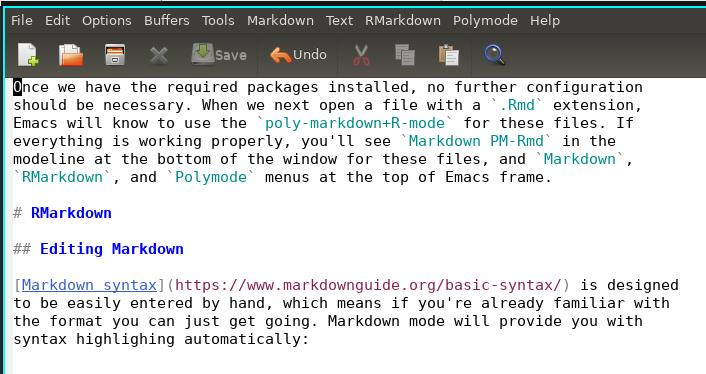
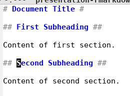
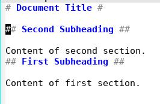
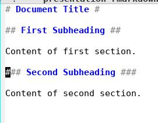
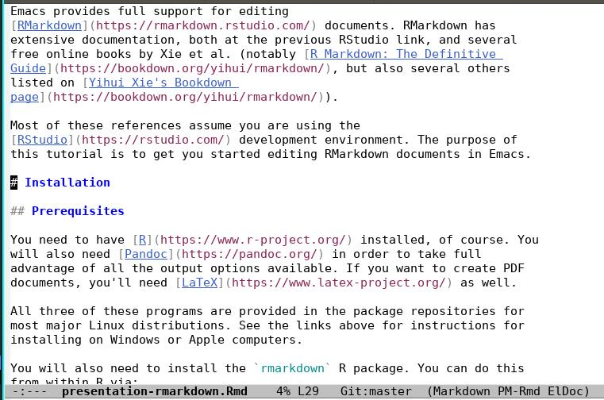
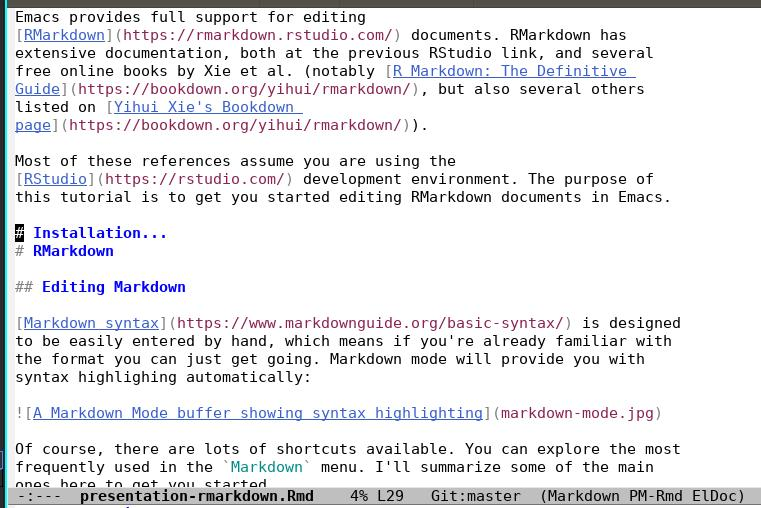
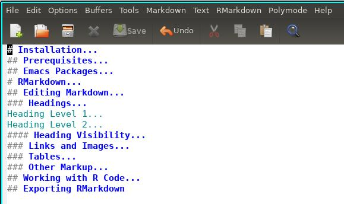

\floatplacement{figure}{H}

Emacs provides full support for editing
[RMarkdown](https://rmarkdown.rstudio.com/) documents. RMarkdown has
extensive documentation, both at the previous RStudio link, and several
free online books by Xie et al. (notably [R Markdown: The Definitive
Guide](https://bookdown.org/yihui/rmarkdown/), but also several others
listed on [Yihui Xie's Bookdown
page](https://bookdown.org/yihui/rmarkdown/)).

Most of these references assume you are using the
[RStudio](https://rstudio.com/) development environment. The purpose of
this tutorial is to get you started editing RMarkdown documents in Emacs.

# Installation

## Prerequisites

You need to have [R](https://www.r-project.org/) installed, of course. You
will also need [Pandoc](https://pandoc.org/) in order to take full
advantage of all the output options available. If you want to create PDF
documents, you'll need [LaTeX](https://www.latex-project.org/) as well. 

All three of these programs are provided in the package repositories for
most major Linux distributions. See the links above for instructions for
installing on Windows or Apple computers.

You will also need to install the `rmarkdown` R package. You can do this
from within R via:

```{R rmarkdown install, eval = FALSE}
install.packages("rmarkdown")
```

This will also install the other R requirements, notably the
[knitr](https://yihui.org/knitr/) package.

The [bookdown](https://bookdown.org/yihui/rmarkdown/) package provides some
more advanced citation features. I won't discuss them in this short
tutorial, but in order to use them you need to install that package too:

```{R bookdown install, eval = FALSE}
install.packages("bookdown")
```

## Emacs Packages

We need a few additional Emacs packages to comfortably edit RMarkdown
documents. These are:

[Markdown Mode](https://github.com/jrblevin/markdown-mode)

: The major mode for editing files in markdown format. **This tutorial uses
  features added after 6 January 2021.**

[ESS](https://ess.r-project.org/ "ESS")

: The collection of modes for editing R code, and interacting with the R
  program. 

[poly-R (Polymode)](https://polymode.github.io/)

: `polymode` is a 'glue' mode. The `poly-R` variant extends markdown mode
  to allow us to edit embedded code snippets in R (and other languages too)
  
  (`poly-R` also supports files in `.Rnw` format, which mix LaTeX and R
  code. We won't cover that here)

  `polymode` started out as a collection of modes to support files with
  different combinations of languages. As it has grown, many of those
  different modes have been split out into separate packages. When we
  install `poly-R`, it will automatically install the core of the
  `polymode` system for us.
  
  **This tutorial uses features added after 29 September 2021.**
  
As in previous tutorials, (see [my
blog](https://plantarum.ca/2020/12/30/emacs-tutorial-03/) or the [demo on
Youtube](https://www.youtube.com/watch?v=So1LYzSk9o0)), we can install all
three of these packages from [MELPA](https://melpa.org/#/).

Once we have the required packages installed, no further configuration
should be necessary. When we next open a file with a `.Rmd` extension,
Emacs will know to use the `poly-markdown+R-mode` for these files. If
everything is working properly, you'll see `Markdown PM-Rmd` in the
modeline at the bottom of the window for these files, and `Markdown`,
`RMarkdown`, and `Polymode` menus at the top of Emacs frame.

### Github Flavoured Markdown and Code Blocks

Markdown mode supports several different options for code blocks. To take
full advantage of the RMarkdown support provided by the `rmarkdown` R
package, we need to use fenced code blocks, along with language strings
wrapped in braces[^1]. I'll explain this in more detail below.

This variant of markdown is referred to as "Github Flavoured Markdown", and
the `markdown-mode` package provides `gfm-mode` with a few extra features
particular to it. Turning on `gfm-mode` for Rmd files requires the
following line in your Emacs configuration to turn it on[^2]:

```{lisp, eval = FALSE}
;; associate the new polymode to Rmd files:
(add-to-list 'auto-mode-alist
             '("\\.[rR]md\\'" . poly-gfm+r-mode))
```

You will also need the following line, if you want `gfm-mode` to
automatically insert braces for code blocks (described below):

```{lisp, eval = FALSE}
;; uses braces around code block language strings:
(setq markdown-code-block-braces t)
```

This will switch you from using `poly-markdown+R-mode` to
`poly-gfm+r-mode`, which shows up in your mode bar as "PM-Rmd(gfm)". It's
nearly similar, the main differences being the support for fenced code
blocks.

# RMarkdown

## Editing Markdown

[Markdown syntax](https://www.markdownguide.org/basic-syntax/) is designed
to be easily entered by hand, which means if you're already familiar with
the format you can just get going. Markdown mode will provide you with
syntax highlighing automatically:



Of course, there are lots of shortcuts available. You can explore the most
frequently used in the `Markdown` menu. I'll summarize some of the main
ones here to get you started.

### Headings

Markdown has two different kinds of headings. The "Atx" style uses `#`
symbols at the beginning of the heading, and, optionally, also at the end:

```

# Heading Level 1

## Heading Level 2 ##

```

You can insert these headings with the following commands:

`C-c C-s h`

: insert a heading at the same level as the previous heading.

  If the `region` is active, the contents of the region will be used as the
  header text. If `point` is on a line with text, the line will be
  converted into a header. Otherwise, an empty header will be created. 

`C-c C-s {1-9}`

: insert a heading at the specified level. i.e., `C-c C-s 3` inserts a
  third-level heading. `region` and `point` can be used to set the heading
  text as for the previous.
  
You can manipulate headings with the following commands:

`C-c <up>` and `C-c <down>`

: move a heading and all of its content up or down in the document.

  ie., turn this:
  
  
  
  into this:
  
  


`C-c <left>` and `C-c <right>`

: promote or demote a heading.

  i.e., turn this:

  
  
  into this (and vice versa):
  
  
  
If you prefer asymmetric headings (i.e., with `#` symbols only at the
beginning of the line), you can configue this by setting the variable
`markdown-asymmetric-header` to `t`:

```{lisp, eval = FALSE}
;; set in your ~/.emacs or ~/.emacs.d/init.el
(setq markdown-asymmetric-header t)
```

Alternatively, you can do this via `M-x customize-variable
markdown-asymmetric-header`. 

Markdown mode also supports the `setext` style headings:

``` 

Heading Level 1
===============

Heading Level 2
---------------

```

Only two levels are supported, which you can insert automatically with the
commands `C-c C-s !` (level 1) and `C-c C-s @` (level 2).

#### Heading Navigation

You can move from heading to heading with the following commands:

`C-c C-n` and `C-c C-p`

: move to next and previous headings 

`C-c C-f` and `C-c C-b`

: move forward and backward to headings at the same level

`C-c C-u`

: move up to parent heading


#### Heading Visibility

You can hide and show different sections in documents by pressing the
`<TAB>` key with point on a heading. For example, with point on the `#
Installation` heading, when I press `<TAB>` I move from this:



to this:



This doesn't change any of the text in your file, it only hides the parts
you don't want to see. Repeatedly pressing the `<TAB>` key will toggle
through the various levels of hiding and showing.

If you want to toggle all the headings at once, `Shift-<TAB>` will toggle
visibility for all headings at once. You can use this to collapse your
entire document to a table of contents:



### Links and Images

Inserting links is done with `C-c C-l`. Emacs will first prompt you for the
link URL, followed by the link text, and finally the tooltip text. Only the
URL is required. To open a link from Emacs, use `C-c C-o`, which will take
you to the webpage in your browser.

Images are handled similarly, and are inserted with `C-c <TAB>` or `C-c
C-i`. The URL can be a web resource (e.g.,
`https://my-images.ca/image1.jpg`), or a local file (e.g.,
`./images/image1.jpg`). The image will appear as:

```

```

You can toggle displaying the actual image in the buffer with `C-c C-x C-i`.

### Tables

To insert a new table, use the command `C-c C-s t`. You will be prompted
for the number of rows and columns, and the alignment you want. When you're
done, you'll have a proper markdown table ready to edit:

```
|   |   |   |   |
|---|---|---|---|
|   |   |   |   |
|   |   |   |   |
|   |   |   |   |

```

With point in any of the cells, you can `<TAB>` into the next cell, or
`Shift-<TAB>` into the previous cell. Each time you hit tab the cells will
resize automatically to accomodate your text.

Additional commands are available for moving, adding and deleting rows and
columns; see the `Markdown -> Tables` menu the options.

### Other Markup

Markdown mode also provides shortcuts for other markup elements. See the
`Markdown` menu for some of the options. I find most of the basics (bold,
emphasis, unordered lists) are just as fast to type by hand as they are to
insert using shortcuts.

## Working with R Code
`rmarkdown` uses fenced code blocks with braces around the language string. i.e.,:

```{R code-block-example}`r ''
## R code goes here!
1 + 1
```
    
If you've set up `gfm-mode` as described above, you can create one of these
code blocks with the command `markdown-insert-gfm-code-block`, bound to
`C-c C-s C` by default. Alternatively, simply entering three "`" characters
at the beginning of a line will call the function for you[^3]. Either way,
you'll be prompted for the language of the code block (which will be R most
of the time, but you can use others!). You can also add a label for the
code block at the prompt, and any additional options you want to use for
the chunk. You can also add options later if you change your mind.[^4]

Once you have created a code block, `polymode` will work its magic. You can
continue to edit the markdown portions of your document, with all the
features of `gfm-mode`. But when point is in an R code block, you'll be
editing it in `ESS[R]` mode. That allows you to use all the features of
that package (see
[plantarum.ca](https://plantarum.ca/tutorials/emacs-tutorial-03/) for a
quick tutorial/refresher).

Polymode provides some additional conveniences:

### Navigation

`polymod-next-chunk`/`polymode-previous-chunk`, bound to `M-n C-n` and `M-n
C-p`

: move to the next/previous chunk. i.e., move from an RMarkdown chunk to
  the next R code chunk.

`polymod-next-chunk-same-type`/`polymode-previous-chunk-same-type`, bound
to `M-n M-C-n` and `M-n M-C-p`

: move to the next/previous chunk of the same type. i.e., move from one R
  code chunk the next R code chunk.
  
`polymode-kill-chunk`, bound to `M-n M-k`

: kill the current chunk

`polymode-toggle-chunk-narrowing`, bound to `M-n C-t`

: toggle narrowing the buffer to display only the current chunk, or to
  display the entire document

### Evaluation

`polymode-eval-region-or-chunk`, bound to `M-n v`

: evaluate all code chunks in the active region, or the chunk at point if there
  is no active region
  
`polymode-eval-buffer`, bound to `M-n b`

`polymode-eval-buffer-from-beg-to-point`/`polymode-eval-buffer-from-point-to-end`,
bound to `M-n u` or `M-n ↑`, and `M-n d` or `M-n ↓`

: evaluate all code chunks from the beginning of the buffer to point (`u`
and `↑`), or from point to the end of the buffer (`d` and `↓`)

## Exporting RMarkdown

The most important 'convenience' of `polymode` is that it connects Emacs to
the programs used to export RMarkdown files to presentation formats (i.e.,
pdf, html, slides). The main function you need for this is
`polymode-export`, bound to `M-n e`. 

The first time you run this, you'll be asked which exporter you would like
to use. There are two choices, `markdown` and `markdown-ess`. `markdown`
means `polymode` will start a new, self-contained R process and compile
your file there. When compilation is finished, the process will be closed.

`markdown-ess` will use an existing R process, or start a new one if there
isn't an active process available. When compilation is complete, the R
process remains active. This allows you to check the values of various
objects interactively. This can be useful as you develop a new script. 

RMarkdown files can be compiled to produce a variety of output formats. You
will be prompted to select which one you want the first time you run the
exporter. `polymode` remembers this setting, so you don't get prompted a
second time. If you want to switch, say from pdf output to html, you can
reset the target via `C-u M-n e`.

[^1]: [Feature added 6 January
2021](https://github.com/jrblevin/markdown-mode/pull/581). 

[^2]: [Feature added 29 September
    2021](https://github.com/polymode/poly-R/pull/27)

[^3]: By default; you can turn this feature off by setting the variable
`markdown-gfm-use-electric-backquote` to nil.

[^4]: I'm working on tab-completion for R chunk options, but haven't
decided how best to set it up yet. Watch this space!
